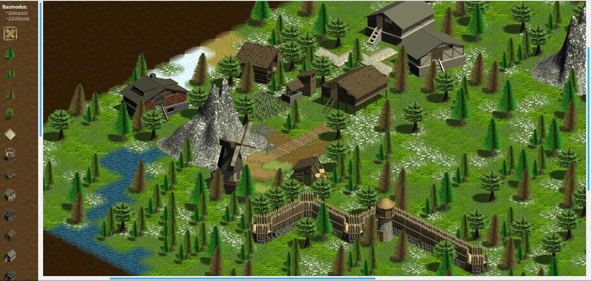

# Iso-3D Experiments

This is a collection of my iso-3D experiments and artwork that I created between 2005 and 2007.  It is published here in the hope that it will be useful.

## Screenshots

This picture shows the browsergame demo in action.

There are also plenty of screenshots of the Turbo Pascal version in the subfolder `MyGameTP`, e.g. [this one](MyGameTP/0012.png).

## Required software

While the browsergame demo can be viewed using any web browser, recreation of the graphics files and executables requires certain pieces of legacy software:

- Caligary TrueSpace, preferably version 2.0 or 3.2
- Borland Turbo Pascal, preferably version 7.0
- SVGA BGI drivers by Jordan Horgraphix Software (shareware)

If you are only interested in the browsergame demo, just download it and open `browsergame.htm`.

## Graphics file conversion

Do not use the GIF versions, as they have reduced color precision.  Use the BMP versions, instead.

You can easily convert them to PNG with transparency using ImageMagick:

    convert MyGameTP/berg_1.bmp -transparent magenta berg_1.png

## License

This work is licensed under the Creative Commons Attribution-ShareAlike 4.0 International License. To view a copy of this license, visit http://creativecommons.org/licenses/by-sa/4.0/ or send a letter to Creative Commons, PO Box 1866, Mountain View, CA 94042, USA.
